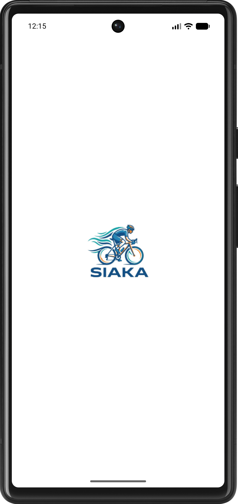
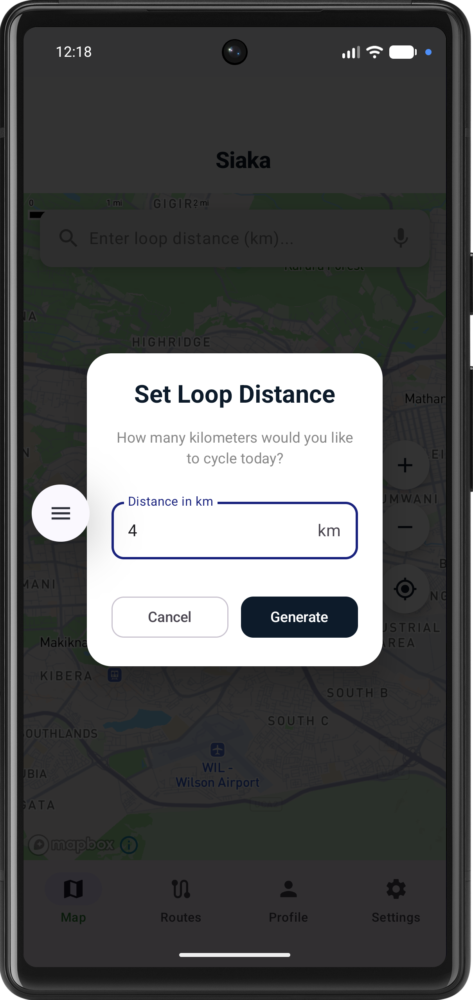
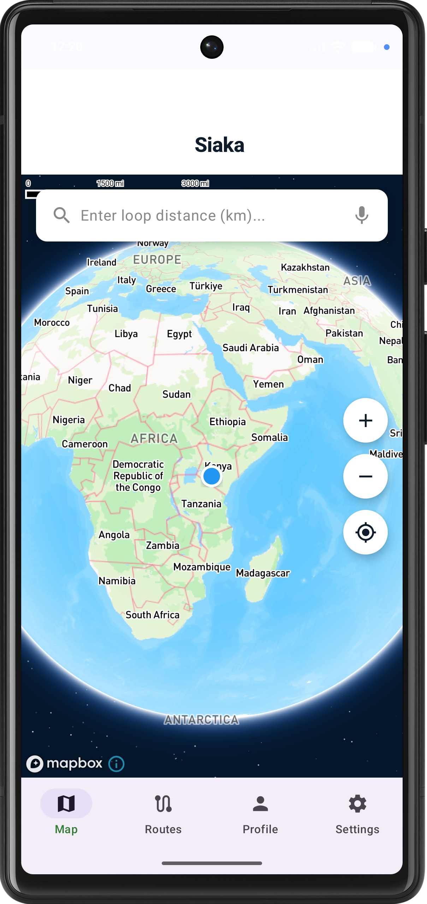
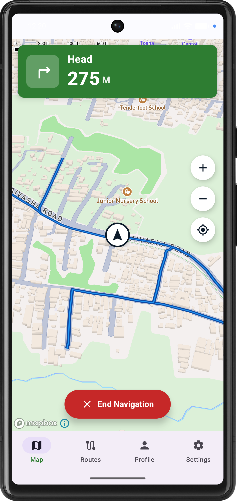

# Siaka 

A Kotlin Android app where cyclists input their desired kilometers and receive randomized cycling routes displayed on an interactive map.

## 📋 Overview

Siaka helps cyclists discover new paths by generating randomized loop routes based on a target distance. Whether you want a quick 5km sprint or a 50km endurance ride, Siaka crafts a unique route starting and ending at your current location.

## 🛠 Tech Stack

- **Jetpack Compose** — Modern UI toolkit
- **Mapbox Maps SDK** — Interactive map rendering and routing
- **Hilt** — Dependency injection
- **Retrofit & OkHttp** — Networking and API communication
- **Coroutines & Flow** — Asynchronous programming and state management
- **Room** — Local database for saving routes

## Permissions

The app requests the following permissions to provide a seamless experience:

- `ACCESS_FINE_LOCATION` — For precise location to generate routes
- `ACCESS_COARSE_LOCATION` — For approximate location fallback
- `INTERNET` — To fetch routes and map tiles

## Getting Started

1. Launch the app and grant location permissions
2. Enter your desired cycling distance in kilometers in the input dialog
3. Tap **"Generate"** to create a randomized cycling path
4. View the route and instructions on the interactive map
5. Tap **"Start Navigation"** to begin your ride
6. Use **"Save Route"** to keep your favorite paths for later

## 📸 Screenshots

|  |  |  |  |
|---|---|---|---|

## Future Enhancements

- Route difficulty levels (flat, hilly, mixed)
- Elevation profile visualization
- Advanced turn-by-turn voice navigation
- Route sharing with other cyclists
- Weather integration

## 👤 Author

[@awstine](https://github.com/awstine)
